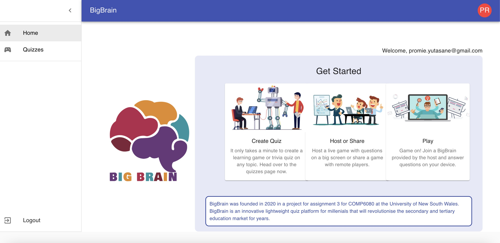
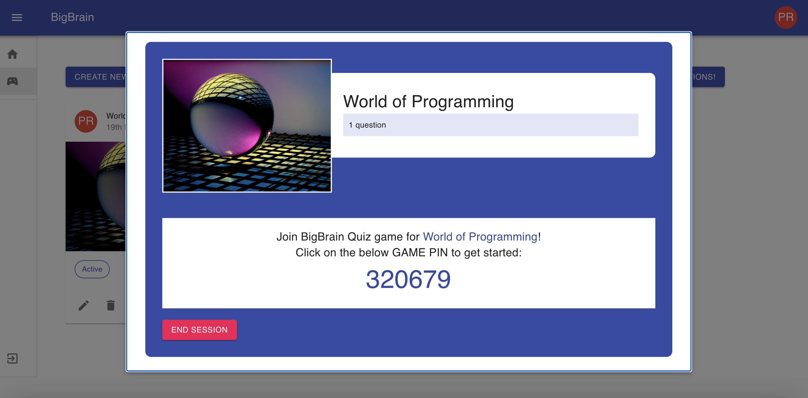
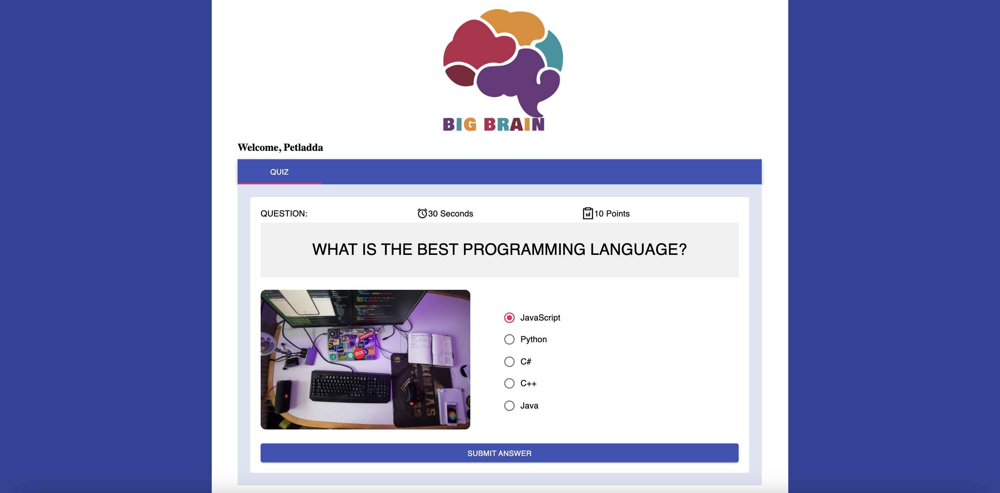

# BigBrain

BigBrain is an innovative lightweight quiz platform for millenials that will revolutionise the secondary and tertiary education market for years. Built with NodeJS, Express, React and Material UI.

## Preview




## Requirements
- Node v14
- Yarn

## Run App Locally
### Backend Setup

**Development**

root directory
```
$ yarn run backend
```

**Unit Tests**
```
$ yarn run test
```

**Lint**
```
$ yarn run lint
```

**Reset Database**
```
$ yarn run reset
```

### Frontend Setup

**Development**
```
$ cd frontend
$ yarn run start
```

**Tests**
```
$ yarn run test
```

## API Documentation

Below is the link to the swagger doc for the API endpoints.
(Please ensure that the backend server is running)

http://localhost:5005/docs/


